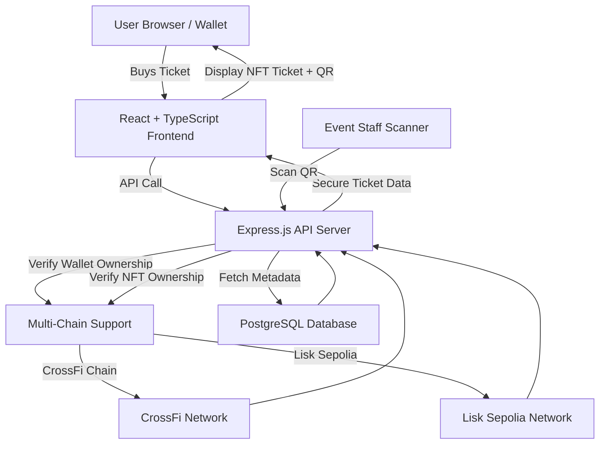

# 🎟️ evennts - Multi-Chain Event Ticketing Platform

**A blockchain-powered ticketing experience that makes scalpers cry and fraudsters unemployed.**  
Built on **CrossFi Chain** and **Lisk Sepolia**, evennts supports XFI, XUSD, and MPX token payments, giving event organizers and ticket buyers a secure, transparent, and NFT-verified way to handle events across multiple blockchain networks.  

---

## 🌟 What Makes It Different

evennts is not just “another ticketing website.”  
It’s a **fully decentralized multi-chain ticketing ecosystem** that:

- **Eliminates Fraud** – Each ticket is minted as an ERC-721 NFT, verifiable on the blockchain.  
- **Accepts Multiple Tokens** – Pay with XFI, XUSD, or MPX.  
- **Multi-Chain Support** – Deploy and interact with events on CrossFi Chain or Lisk Sepolia.  
- **Works for Any Event** – From music festivals to exclusive online experiences.  
- **Protects Access** – Tickets are tied to verified wallet addresses — no “URL guessing” hacks here.  
- **Feels Effortless** – Intuitive design for buyers, full control for organizers.  

---

## 👥 Who It's For

- **Event Organizers:** Create, manage, and sell tickets securely, knowing each one is authentic.  
- **Ticket Buyers:** Purchase confidently, own your ticket on the blockchain, and breeze through entry.  
- **Event Staff:** Scan and verify tickets in seconds — even without a connected wallet.  

---

## 🛠️ Key Features

### For Event Organizers
- Create events with customizable ticket tiers.
- Accept payments in XFI, XUSD, or MPX.
- Automatic NFT minting for every ticket sold.
- QR code scanning for on-site verification.
- Organizer dashboard with event analytics.
- **Multi-chain deployment** - choose between CrossFi Chain or Lisk Sepolia.

### For Ticket Buyers
- Purchase securely with Web3 wallet integration.
- Receive verifiable NFT tickets stored in your wallet.
- Scannable QR codes for quick entry.
- Guaranteed authenticity and ownership.
- **Chain selection** - interact with events on your preferred network.

### Under the Hood (Technical)
- **Smart Contracts:** Solidity contracts for event creation, ticket sales, and verification.
- **Backend:** Node.js + Express REST API with secure middleware and multi-chain support.
- **Frontend:** React + TypeScript + Tailwind CSS for a responsive, mobile-first UI.
- **Web3 Integration:** Ethers.js for seamless blockchain interaction across multiple networks.
- **Security:** Address-level access control, no ticket caching for unverified users.
- **Multi-Chain Architecture:** Support for CrossFi Chain and Lisk Sepolia testnet.

---

## 🏗️ How It Works — Architecture



---

## 📖 Example User Journey

**1. Event Creation**
An organizer logs in with their Web3 wallet, selects their preferred blockchain (CrossFi or Lisk), fills in event details, sets ticket tiers, and chooses accepted payment tokens.

**2. Ticket Purchase**
A buyer browses events, selects a ticket tier, connects their wallet, and confirms the purchase on the chosen blockchain. The system instantly mints an NFT ticket tied to their wallet address.

**3. Event Entry**
At the venue, staff scan the ticket QR code. The backend verifies ownership and validity on the appropriate blockchain in real time before granting access.

---

## 🔒 Security by Design

* **Ownership Binding:** Tickets can only be viewed/used by the wallet that purchased them.
* **No Sneak-Ins:** Direct URL access without verification is blocked.
* **Immutable Proof:** All tickets are recorded on the blockchain as NFTs.
* **Tamper-Proof Scanning:** QR codes are tied to blockchain verification, not just image matching.
* **Multi-Chain Security:** Each blockchain network provides its own security guarantees.

---

## 🌐 Try It Online

No need to set up anything locally.
You can experience the full platform live here: **[evennts Demo](https://eventfi-vhmz.onrender.com/)**

---

## 📄 Smart Contract Overview

**EventManager.sol** — The core contract for:

* Event creation and management.
* Ticket tier definition and sales.
* NFT minting and ownership verification.
* On-chain ticket usage marking.

**Security Patterns Used:**

* `ReentrancyGuard` for transaction safety.
* `AccessControl` for organizer-only functions.
* Strict input validation.

---

## 💡 Inspiration & Vision

EventFi was born from the frustration of counterfeit tickets, scalping, and lack of transparency in event ticketing. We merged **NFT tech**, **Web3 payments**, and a **smooth user experience** to create a platform that empowers both organizers and attendees — without the shady middlemen.

The vision? A world where buying a ticket is as exciting as attending the event — and as secure as holding a private key.

---

## 🙏 Credits & Acknowledgments

* **CrossFi Chain** – Our blockchain backbone.
* **OpenZeppelin** – For secure smart contract libraries.
* **React & Ethers.js Communities** – For powering the frontend and blockchain connections.
* And the countless event-goers who inspired us to build something better.

---

Built with ❤️ for the multi-chain Web3 ecosystem.

---

## 🚀 Lisk Track Integration

### Multi-Chain Support
evennts now supports deployment and interaction on **Lisk Sepolia testnet** alongside the existing CrossFi Chain integration. This allows users to:

- **Deploy smart contracts** on Lisk Sepolia testnet
- **Create and manage events** on either CrossFi Chain or Lisk Sepolia
- **Purchase tickets** using the same interface across multiple networks
- **Verify tickets** regardless of which blockchain they were minted on

### Lisk Sepolia Configuration
- **Chain ID:** 4202
- **RPC URL:** `https://rpc.sepolia.lisk.com`
- **Explorer:** `https://explorer.sepolia.lisk.com`
- **Network Name:** Lisk Sepolia

### Technical Implementation
The backend includes a modular architecture that supports multiple blockchain providers:

```javascript
// Example usage in backend
import { getEventManagerContract } from './config/blockchain.js';

// Get contract for CrossFi Chain
const crossfiContract = getEventManagerContract('crossfi');

// Get contract for Lisk Sepolia
const liskContract = getEventManagerContract('lisk');
```

### Deployment
Contracts can be deployed to Lisk Sepolia using Hardhat:
```bash
npx hardhat run scripts/deployLisk.js --network lisk
```

### Benefits of Multi-Chain Support
- **Reduced Network Congestion:** Distribute load across multiple networks
- **User Choice:** Let users choose their preferred blockchain
- **Redundancy:** Failover capability between networks
- **Ecosystem Integration:** Tap into multiple blockchain communities
npx hardhat run scripts/deployLisk.js --network lisk
